# 项目概述
LogiCommon 公共模块，包括Logi-security、Logi-job 。LogiCommon 会尽量保持与具体业务的解耦，以简单易用，轻量高效，尽可能减少用户感知的方式做到多平台适配，同时提供可扩展的接口，让用户自由的扩展 LogiCommon 的功能，以满足具体的业务。
- Logi-security 主要提供基础功能服务，主要分为认证、鉴权、管理三部分功能。其中认证包括了登录、注册、注销等功能；鉴权包括了确定用户的界面权限、资源权限的功能；管理包括了用户、项目、角色、部门的基本操作的功能和操作日志、消息通知的调控功能；
- Logi-job 是分布式的定时调度服务
## 1.logi-security
### 1.1 介绍
logi-security 提供项目大多都需要基础的一些功能（用户、角色、权限、登录、注册、操作记录），这些功能开发简单但是开发起来又比较繁琐和有一定的工作量（开发、测试、联调、编写接口文档等等），所以打算把这类的功能抽取出来，整合进 Logi-security，让这些项目开发人员更加专注于核心功能，避免时间花费在繁琐的基础功能的开发。
### 1.2 功能支持
主要提供：用户、项目、角色、部门、界面权限、资源权限、操作日志、消息通知
- 用户模块：提供了注册、登录、认证功能，以及用户信息的展示等基础功能；
- 项目模块：提供了创建、删除、展示、更改运行状态等功能；
- 部门模块：提供了部门信息导入、部门树形结构展示等功能；
- 界面权限模块：提供界面权限信息的导入、界面功能展示控制等功能；
- 资源权限模块：提供对项目具体资源的权限管理；
- 操作日志模块：记录用户的操作记录，展示记录；
- 消息通知模块：用户拥有的角色、拥有的资源权限变更等通知。
### 1.3 使用方式
#### 1.3.1 添加Maven
```xml
<dependency>
    <groupId>io.github.zqrferrari</groupId>
    <artifactId>logi-security-spring-boot-starter</artifactId>
    <version>1.6.3</version>
</dependency>
```
#### 1.3.2 配置文件
logi-security基于springBoot框架开发，需添加以下配置信息：
```properties
logi.security.app-name: ES
logi.security.resource-extend-bean-name: myResourceExtendImpl

# ---------------数据源信息---------------
logi.security.username=root
logi.security.password=123456
logi.security.url=jdbc:mysql://localhost:3306/logi_security?useUnicode=true&characterEncoding=utf-8&useSSL=false&serverTimezone=Asia/Shanghai
logi.security.driver-class-name=com.mysql.jdbc.Driver
```
- app-name：表示应用的名称，涉及到 logi-security 的数据库操作都会带上这个条件（查询、保存等操作）；
- resource-extend-bean-name：resourceExtend的实现类在spring容器bean的名称，logi-security 中资源权限管理模块，需要获取具体资源的信息，所以用户需实现 ResourceExtend 接口并指定实现类在spring容器中bean的名称；
#### 1.3.3 需要实现接口
用户可选的实现 ResourceExtend 接口，如果不实现，则资源权限管理模块的功能不能完整使用。接口详情见代码
```java
package com.didiglobal.logi.security.extend;

import com.didiglobal.logi.security.common.PagingData;
import com.didiglobal.logi.security.common.dto.resource.ResourceDTO;

import java.util.List;

/**
 * 资源扩展接口
 */
public interface ResourceExtend {

    /**
     * 获取资源信息List，资源id指的是该资源所在服务对该资源的标识
     * @param projectId 项目id（可为null）
     * @param resourceTypeId 资源类型id（可为null，不为null则projectId必不为null）
     * @param resourceName 资源名称（可为null，模糊查询条件）
     * @param page 当前页（分页条件）
     * @param size 页大小（分页条件）
     * @return 资源信息List
     */
    PagingData<ResourceDTO> getResourcePage(Integer projectId, Integer resourceTypeId, String resourceName, int page, int size);

    /**
     * 获取资源信息List，资源id指的是该资源所在服务对该资源的标识
     * @param projectId 项目id（可为null）
     * @param resourceTypeId 资源类型id（可为null，不为null则projectId必不为null）
     * @return 资源信息List
     */
    List<ResourceDTO> getResourceList(Integer projectId, Integer resourceTypeId);

    /**
     * 获取具体资源个数，资源id指的是该资源所在服务对该资源的标识
     * @param projectId 项目id（可为null）
     * @param resourceTypeId 资源类型id（可为null，不为null则projectId必不为null）
     * @return 资源信息List
     */
    int getResourceCnt(Integer projectId, Integer resourceTypeId);
}
```
#### 1.3.4 导入数据
logi-security相关界面并没提供【角色权限元数据、资源类别数据、部门信息数据、操作日志相关（操作页面、操作对象、对象分类）】的创建功能，logi-security提供了数据导入的接口。
建议全部都导入，简单的数据也行。
## 2.logi-job
### 2.1 介绍
是分布式的定时调度服务。
### 2.2 功能支持
主要提供：分布式定时调度服务、任务管理、分布式锁等功能
- 分布式定时调度服务：添加指定注解，并实现规定的接口，编写待调度的方法；
- 任务管理模块：提供查看任务列表、任务详情、手动执行任务、变更任务状态、任务日志等功能；
- 分布式锁机制：确保多系统下，对于临界资源的保护，和调节调度秩序，防饿死。
### 2.3 使用方式
#### 2.3.1 添加Maven
```xml
<dependency>
    <groupId>io.github.zqrferrari</groupId>
    <artifactId>logi-job-spring-boot-starter</artifactId>
    <version>1.0.4</version>
</dependency>
```
#### 2.3.2 配置信息
logi-job基于springBoot框架开发，在使用的时候需要在配置文件中增加几项配置信息，如下：
```yaml
spring:
  logi-job:
    jdbc-url: jdbc:mysql://localhost:3306/es_manager_test?useUnicode=true&characterEncoding=utf8&jdbcCompliantTruncation=true&allowMultiQueries=true&useSSL=false
    username: root
    password: 123456
    driver-class-name: com.mysql.jdbc.Driver
    max-lifetime: 60000
    init-sql: true
    init-thread-num: 10
    max-thread-num: 20 #调度最大线程数
    log-exipre: 3  #日志保存天数，以天为单位
    app_name: arius_test02 #应用名，用户隔离机器和环境
    claim-strategy: com.didiglobal.logi.job.core.consensual.RandomConsensual #调度策略，有两种随机和广播，默认是随机
```
#### 2.3.3 使用样例
```java
package com.didichuxing.datachannel.arius.admin.task.metadata;

import com.didichuxing.datachannel.arius.admin.metadata.job.cluster.monitor.esMonitorJob.MonitorJobHandler;
import com.didiglobal.logi.job.annotation.Task;
import com.didiglobal.logi.job.common.TaskResult;
import com.didiglobal.logi.job.core.job.Job;
import com.didiglobal.logi.job.core.job.JobContext;
import org.slf4j.Logger;
import org.slf4j.LoggerFactory;
import org.springframework.beans.factory.annotation.Autowired;

// @Task 注解自带了 @Component
@Task(name = "esMonitorJob", description = "monitor调度任务", cron = "0 0/1 * * * ? *", autoRegister = true)
public class ESMonitorJobTask implements Job {
    private static final Logger LOGGER = LoggerFactory.getLogger(ESMonitorJobTask.class);

    @Autowired
    private MonitorJobHandler monitorJobHandler;

    @Override
    public TaskResult execute(JobContext jobContext) throws Exception {
        LOGGER.info("class=ESMonitorJobTask||method=execute||msg=start");
        monitorJobHandler.handleJobTask("");
        return TaskResult.SUCCESS;
    }
}
```
## 3.logi-log
### 3.1 介绍
集成了：logi-log-log、logi-log-log4j2。
### 3.2 添加maven
```xml
<dependency>
    <groupId>io.github.zqrferrari</groupId>
    <artifactId>logi-log-log</artifactId>
    <version>1.0.4</version>
</dependency>
```
### 3.2 logi-log-log
logi-log-log是基于slf4j封装的组件，为用户提供日志相关功能。各个业务可以选择log4j，logback，log4j2，只要配置上桥接就可以使用。
#### 3.2.1 Trace功能
Trace功能，是为了根据一个flag，把单个请求的日志关联起来。
1. 入口设置flag

2. Logger对象
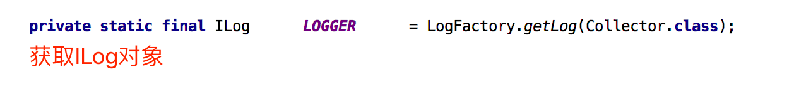
3. 打印日志
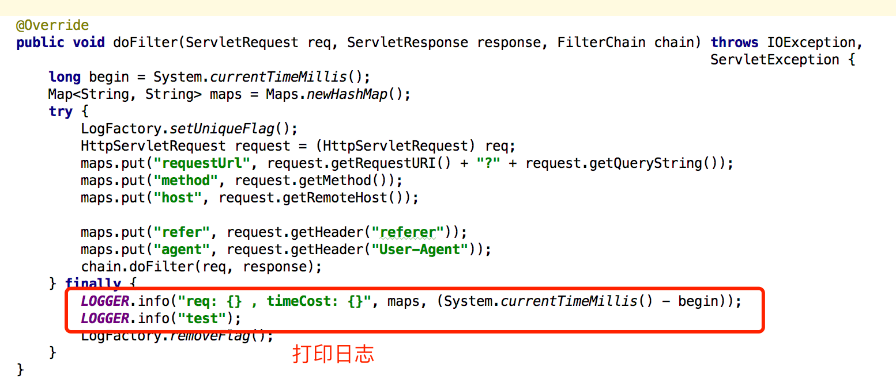
4. 日志打印结果
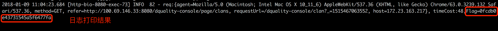
5. 根据flag，查询单次请求相关日志

另，新建的线程里打印日志，是不会自动带上flag的，如果需要，可以将flag传入runnable对象。
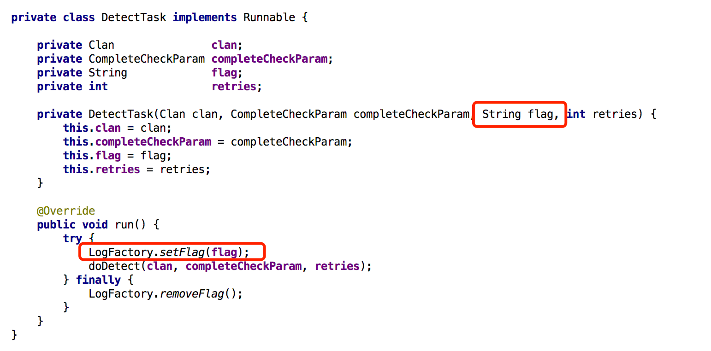
#### 3.2.2 日志聚合
1. 日志聚合

  是为了防止频繁打印日志，影响应用的运行，特别是在异常场景下，每条数据都会触发异常。聚合是通过key来实现聚合的，可以自定义key来实现多种聚合。
  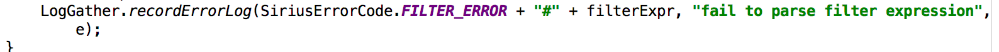

2. 日志采样
  

3. 聚合结果

  count表示同一个key出现多少次
  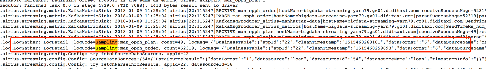
### 3.3 logi-log-log4j2
logi-log-log4j2，是基于log4j2 2.9.1封装的，支持日志发送到kafka，以及过滤重复日志功能。
#### 3.3.1 日志发送到kafka
配置kafka appender和layout
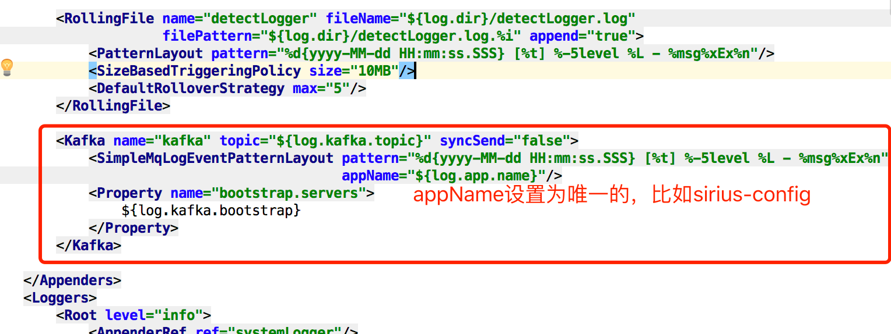
配置appender

```xml
<Appenders>
    <Kafka name="kafka" topic="${log.kafka.topic}" syncSend="false">
        <SimpleMqLogEventPatternLayout pattern="%d{yyyy-MM-dd HH:mm:ss.SSS} [%t] %-5level %L - %msg%xEx%n"
                                       appName="${log.app.name}"/>
        <Property name="bootstrap.servers">
            ${log.kafka.bootstrap}
        </Property>
    </Kafka>
 
</Appenders>
<Loggers>
    <logger name="errorLogger" additivity="false">
        <level value="error"/>
        <AppenderRef ref="errorLogger"/>
        <AppenderRef ref="kafka"/>
    </logger>
</Loggers>
```
日志输出形如：
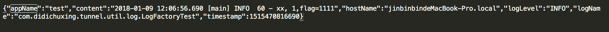
也可以选择直接发送原始日志：
```xml
<Kafka name="kafka" topic="${log.kafka.topic}" syncSend="false">
    <PatternLayout pattern="%d{yyyy-MM-dd HH:mm:ss.SSS} [%t] %-5level %L - %msg%xEx%n"/>
    <Property name="bootstrap.servers">
        ${log.kafka.bootstrap}
    </Property>
</Kafka>
```
#### 3.3.2 过滤重复日志
配置appender即可
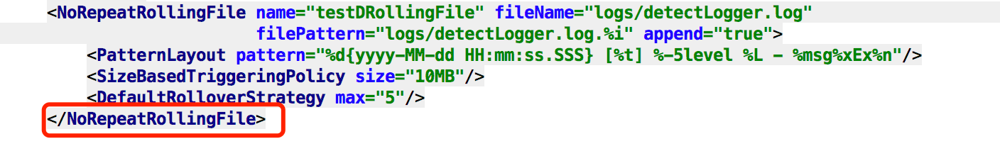
打印日志

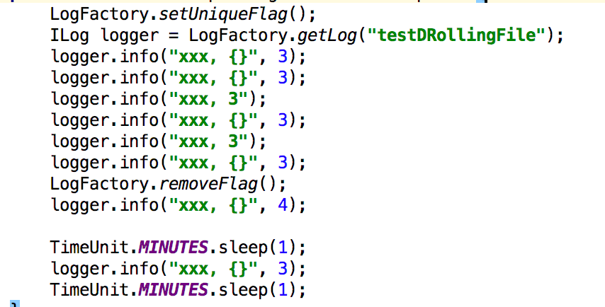

日志输出如，count代表1分钟内，同样的日志出现几次
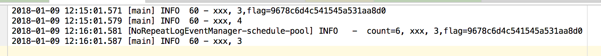

## 4.logi-metrices
Arius内部指标采集和计算的工具包。
### 4.1 添加Maven
```xml
<dependency>
    <groupId>io.github.zqrferrari</groupId>
    <artifactId>logi-metrices</artifactId>
    <version>1.0.4</version>
</dependency>
```
## 5.logi-dsl-prase
用于解析dsl语法树的组件，用于解析用户查询的dsl，生成dsl模板，用于gatewayjoin日志的聚合，dsl限流等场景。
### 5.1 添加Maven
```xml
<dependency>
    <groupId>io.github.zqrferrari</groupId>
    <artifactId>logi-dsl-prase</artifactId>
    <version>1.0.4</version>
</dependency>
```